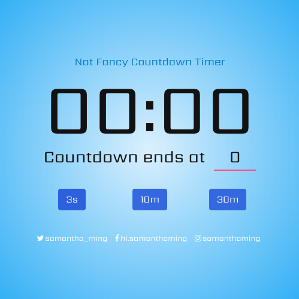

# Not Fancy Countdown Timer

A simple, not fancy at all, Countdown Timer.

**Features include:**
- Select desired countdown time
- Display countdown time
- Display countdown end time

**Built using:**
- Vue
- Bulma
- JavaScript Date Object
- Google Fonts - Sarpanch

<br>

Play around with it on [CodePen](https://codepen.io/samanthaming/pen/WgrYZr)  
Or see it live! [here](https://samanthaming.github.io/not-fancy-countdown-timer/)

<br>



# Notes

Here are the general steps to create your own Not Fancy Countdown Timer.

## 1. Start Countdown

We will use the Date object to get the current time. Then, we will use `setInterval` to create the countdown.

```javascript
methods: {
  timer(seconds)  {
    const now = Date.now(); // this will be in milliseconds
    // 1. We need to convert our seconds into milliseconds
    const end = now + (seconds * 1000);
    
    setInterval(() => {
      // 2. We will convert it back to seconds and take their rounded value
      const secondsLeft = Math.round((end - Date.now()) / 1000);
      
      // ex. This will be 9,8,7,6...etc
      console.log(secondsLeft);
    }, 1000);
  }
}
```

## 2. Stop Countdown

The countdown will continue into the negative numbers. So we want to end the timer. To do this, we need to store the interval in a variable, so we can clear it. Let's refactor our code a bit.

```javascript
// 1. I'm putting it outside the vue object because I need
//  to access it in multiple methods
var intervalTimer;

methods: {
  timer(seconds = 10) {
    // ...
    
    // 2. We will pull out or interval and put it into a method instead
    this.countDown(end);
  },
  countdown(end) {
    intervalTimer = setInterval(() => {
      const secondsLeft = Math.round((end - Date.now()) / 1000);
      
      if(secondsLeft <= 0) {
        // 3. Now we can cancel it
        clearInterval(intervalTimer);
        return;
      }
    })
  }
}
```

## 3. Display Time Left

Alright now let's display our countdown time.

```javascript
data: {
  timeLeft: '',
},
methods: {
  timer(seconds) {
    // 1. Because our setInterval kicks in after 1 sec
    //  we'll set the initial display time as the selected seconds
    this.displayTimeLeft(seconds);
    
    // 2. Trigger out countdown
    this.countdown(end);
  },
  countdown(end) {
    intervalTimer = setInterval(() => {
      // ...
      
      // 3. Update the time after every 1 sec
      this.displayTimeLeft(secondsLeft)
    }, 1000);
  },
  displayTimeLeft(secondsLeft) {
    const minutes = Math.floor((secondsLeft % 3600) / 60);
    const seconds = secondsLeft % 60;
  
    // 4. Store the time in our data variable
    this.timeLeft = `${minutes}:${seconds}`;
  },
}
```

## 4. Display End Time

If you also want to display the end time. All we have to do is pass the milliseconds and we'll get our date object. Then using that information, we can extract the hour and minutes.

```javascript
methods: {
  displayEndTime(timestamp) {
    const end = new Date(timestamp);
    const hour = end.getHours();
    const minutes = end.getMinutes();

    this.endTime = `${hourConvert(hour)}:${zeroPadded(minutes)}`
  },
}
```

## Date Object

The Date object is used to work with dates and times. Date objects are created with the new Date() constructor. There are 4 ways to instantiate a date. In other words, 4 ways to create a new date object.

### 1. No arguments

Without any argument, you will get the current milliseconds since Jan 1, 1970 UTC.

```javascript
new Date(); 

// 1534800780519
```

This means that we are **1534800780519** milliseconds past January 1, 1970.

### 2. Argument: milliseconds

You can pass in milliseconds as the argument, it will return a date object.

```javascript
new Date(1534800780519)

// Mon Aug 20 2018 14:33:00 GMT-0700 (Pacific Daylight Time)
```

### 3. Argument: date string

You can also create a date object by passing a string

```javascript
// International Standard
new Date('2018-08-30') 

// Short Date
new Date('08/30/2018');

// Long Date
new Date('Aug 30 2018');
new Date('30 Aug 2018');
new Date('August 20 2018');
```

### 4: Argument: Date Components

```javascript
/* 
new Date(
  year, 
  month, 
  day, 
  hours, 
  minutes, 
  seconds, 
  milliseconds) 
*/

new Date(2018, 08, 20, 16, 34, 12, 24);

// Thu Sep 20 2018 16:34:12 GMT-0700 (Pacific Daylight Time)
```

Note the months are zero-based. Therefore `08` represents September and NOT August. 

You can also omit some of the values. In those cases, `0` is the default value. You can also use `null` to skip over those values.

```javascript
new Date(2018, 7, 20, null, 0);

// Mon Aug 20 2018 00:00:00 GMT-0700 (Pacific Daylight Time)
```

# Resources

- [JavaScript30 by wesbos](https://github.com/wesbos/JavaScript30)
- [JavaScript30: Countdown Timer YouTube](https://youtu.be/LAaf7-WuJJQ)
- [MDN: Date Object](https://developer.mozilla.org/en-US/docs/Web/JavaScript/Reference/Global_Objects/Date)
- [Alligator.io: Exploring the JS Date Object](https://alligator.io/js/date-object/)
